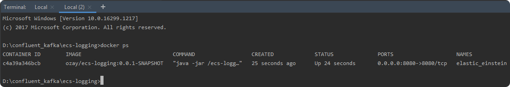
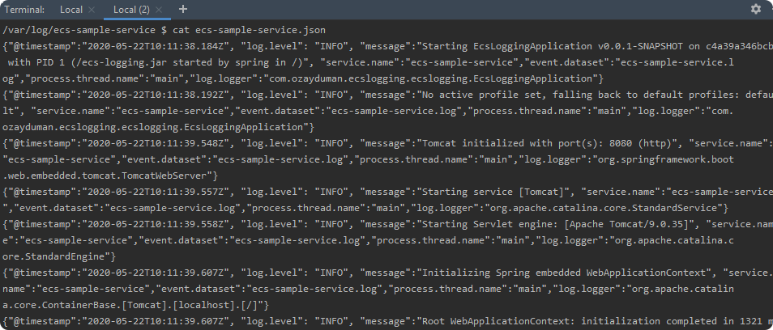

## This project shows how to use _**logback-ecs-encoder**_ for elastic stack logging
I'm using The Spotify Maven Docker plugin to buid and deploy docker images

## 1. BUILD THE PROJECT
To build docker image of this project run the following commands:
```
mvn package
mvn dockerfile:build
```

## 2. RUN THE CONTAINER
```
docker run -p 8080:8080 ozay/ecs-logging:0.0.1-SNAPSHOT
```

## 3. CHECK LOG FILES

```
docker ps 
```



````
docker exec -it c4a39a346bcb ash
cd var/log/ecs-sample-service
````

you will see two log files _**ecs-sample-service.json**_ and _**ecs-sample-service.log**_with the following content:



